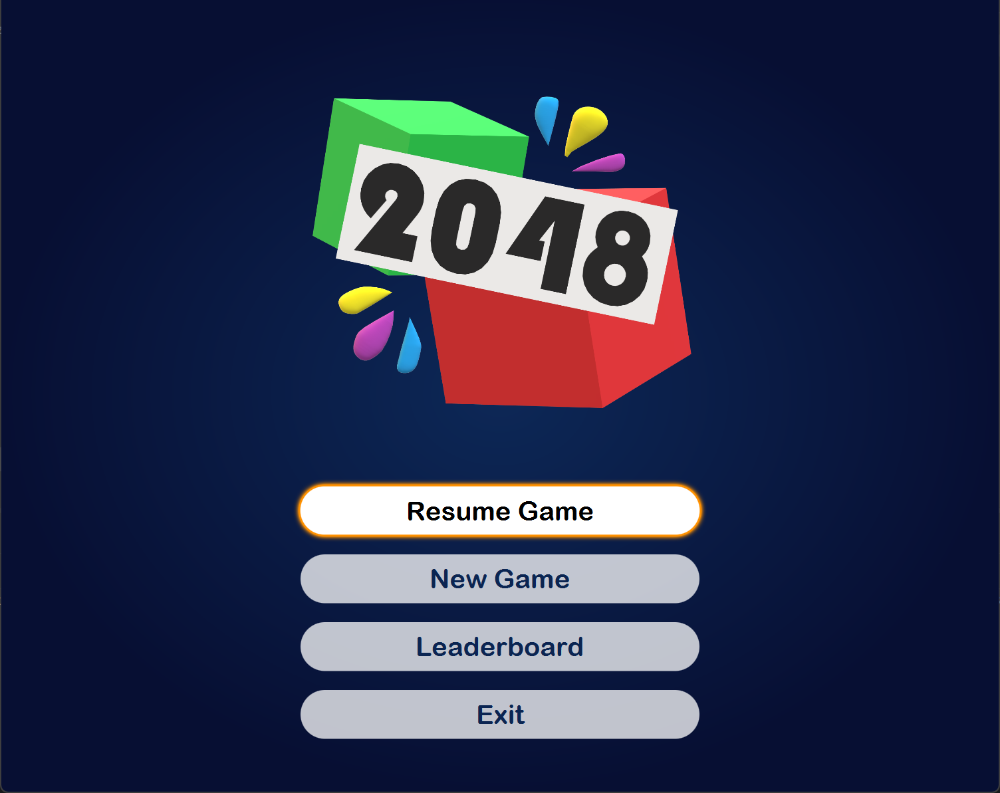
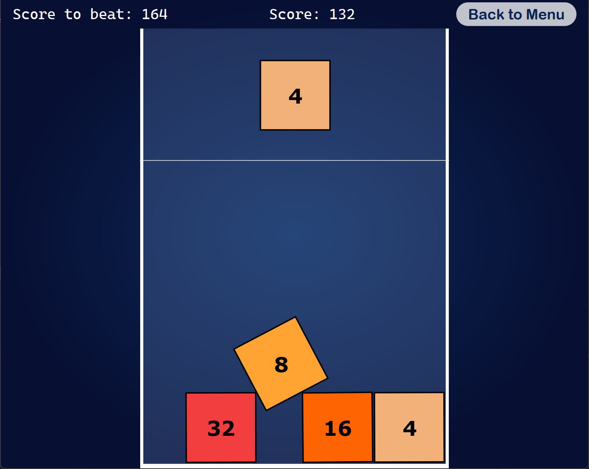

# Gravity 2048

Semestrálny projekt pre predment _Programovanie (4) - Java_

## O hre

Aplikácia je modifikovaná verzia logickej hry 2048. Cieľom je spájať bloky s rovnakými hodnotami, a tak nahrať čo najvyššie skóre. Rovnako ako v klasickej verzii, hodnoty blokov sú mocninami čísla 2.

Rozdielom je, že namiesto blokov umiestnených a pohybujúcich sa v mriežke, bloky voľne padajú v priestore hracej ploche. Nové bloky sa generujú vo vrchnej časti hracej plochy v konštantnej výške. Nový blok musí hráč umiestniť na požadované miesto a keď hráč blok pustí, blok začne padať smerom nadol hracej plochy pôsobením "gravitácie".

Hra končí v momente, keď počas uvoľnenia nového bloku aspoň jeden z existujúcich blokov presahuje vyznačenú čiaru v hornej časti hracej plochy.

## Ovládanie 🎮

Hráč môže ovládať umiestnenie bloku pomocou myši alebo klávesnice. 

### Myš:
- **Presunutie bloku**: Kliknutím a potiahnutím bloku ľavým tlačidlom myši.
- **Uvoľnenie bloku**: Pustením ľavého tlačidla blok začne padať.

### Klávesnica:
- **Posun doľava**: Šípka doľava.
- **Posun doprava**: Šípka doprava.
- **Uvoľnenie bloku**: Šípka nadol alebo medzerník.

## Spúšťanie
V intelliJ spustite projekt cez triedu `GameApp`.

<table>
  <tr>
    <td></td>
    <td></td>
  </tr>
</table>

---

### Zdroje
Ilustrácie použité v dialógových oknách sú
[Pódium](https://www.freepik.com/icon/podium_7921939)
a
[Game Over](https://www.flaticon.com/free-icon/game-over_6851342?term=game+over&page=1&position=3&origin=tag&related_id=6851342).
